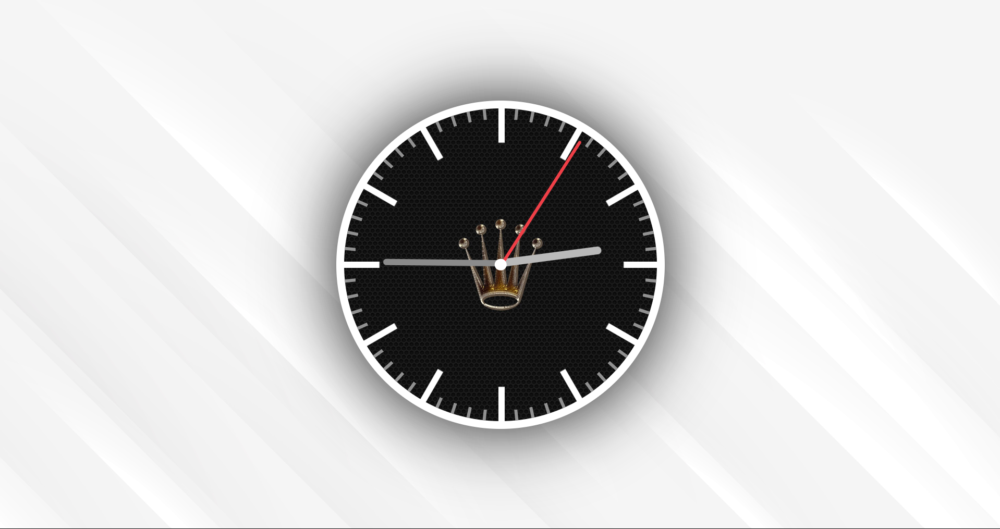

# Analoge Uhr

## Funktionen

- Zeigt die aktuelle Uhrzeit an  
- Responsives Design  
- Implementiert ausschließlich mit **CSS** und **JavaScript**

## Entstehung

Der Auftrag bestand darin, eine analoge Uhr zu erstellen, die ausschließlich mit **JavaScript** und **CSS** programmiert wird. Das grundlegende **HTML-Gerüst** mit den erforderlichen Klassen wurde mir zur Verfügung gestellt.

### Link zum Bild

[**Analoge Uhr**](https://maelseewal.github.io/Analoge-Uhr/ "Link zu Analogen Uhr")

